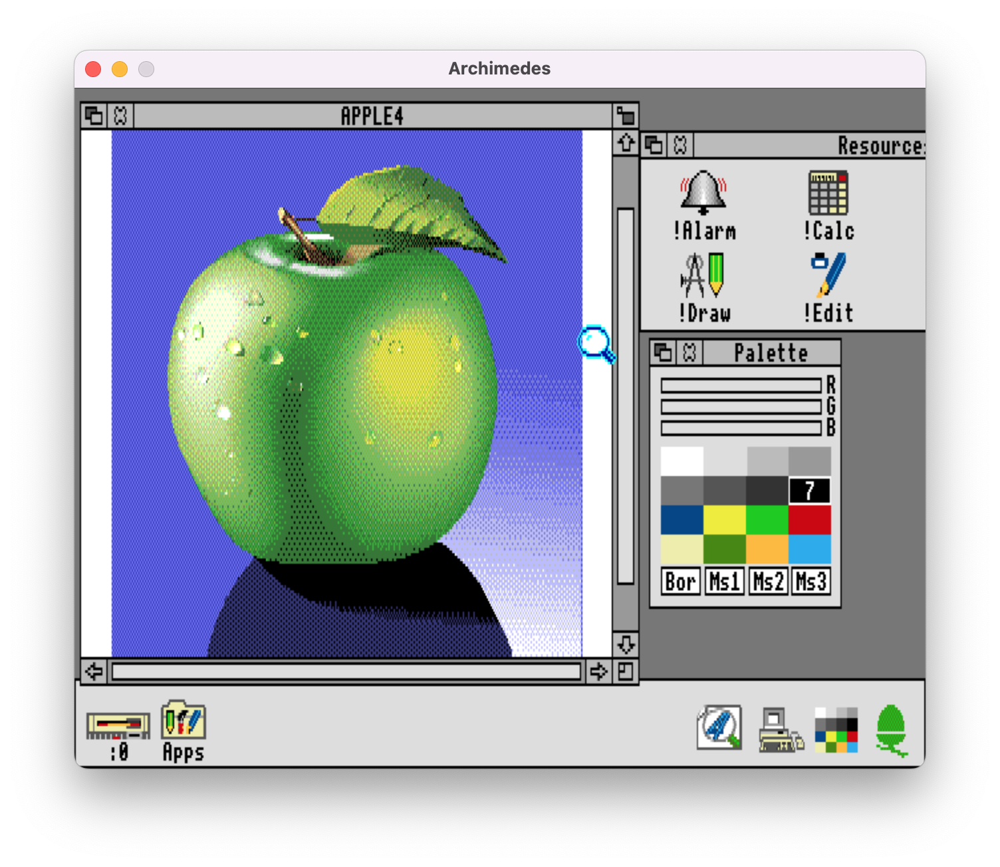
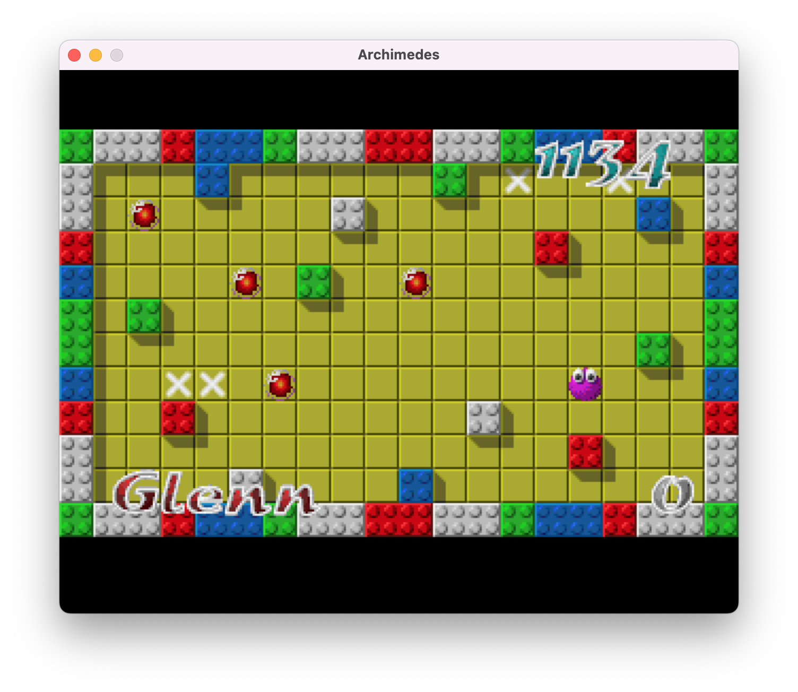

# Eichhörnchen

Eichhörnchen (German for Squirrel) is an Acorn Archimedes A3000 Emulator for running 26-bit versions of RISC OS 
written in C++23 for Windows, Mac and Linux. It's licensed under the terms of the MIT licence.

<p float="left">
  
  
</p>

The project goal is to develop an Archimedes emulator with a high degree of test coverage
to deliver a great user experience.

## Building

### Requirements
Eichhörnchen requires C++23 and uses CMake as its build tool (3.6.0 or later).

### Build steps

To perform an out of source build run the following series of commands

```bash
git clone https://github.com/RichardBrown384/Eichhoernchen.git
mkdir build
cd build
cmake -G <preferred generator> ../Eichhoernchen
```

### Running tests

To run the tests run the following command in the build directory
```bash
ctest --verbose -C debug
```

## Running

### Requirements
In order to run the application you're going to require a copy of RISC OS 2.00 (or 3.00 or 3.1x) [ROMS][riscos-com]
(⚠️Certificate not valid⚠️). Currently, the application expects RISC OS 2.00 ROM files to reside in `./bios/riscos-200` 
relative to the application's working directory. Other versions of the OS can be used but require the use of 
command-line switches (see below).

### RISC OS 2
Assuming the application was built in a directory called `build` you can run the application with a disc image
by typing 

```bash
./build/Frontend/frontend archimedes your_disc.adf
```

While the application starts up hold down delete key to force RISC OS to perform a CMOS reset
(see [#9][iss9]). If the reset was successful you will be presented with a desktop replete with Icon Bar.

### RISC OS 3
To use RISC OS 3 the application needs to be told where the RISC OS 3 ROM files reside. Start the application
(assuming the ROM image comprises the usual 4 files) with

```bash
./build/Frontend/frontend archimedes your_disc.adf --bios-files ./bios/riscos-311/IC24.ROM ./bios/riscos-311/IC25.ROM
./bios/riscos-311/IC26.ROM ./bios/riscos-311/IC27.ROM
```

Holding down delete to reset the CMOS doesn't currently work for RISC OS 3 (see [#2][iss2]) so getting into a desktop with
an accessible floppy disc requires a few more steps. At the supervisor prompt type

```bash
CONFIGURE FLOPPIES 1
CONFIGURE WIMPMODE 12
DESKTOP
```

Once in the desktop:

1. Click on Apps (bottom left)
2. Double-click on !Configure to launch it
3. Click on the Configure icon in the Icon Bar
4. Click on Floppies
5. Click on OK
6. Click on OK when presented with the warning about changing the number of discs

## Current limitations

The application should be considered as pre-release material and there are a couple of nice-to-haves that are
currently missing that severely impact the usability.

1. Any changes made to floppy discs aren't saved when the application exits (see [#16][iss16]).
This is currently a safety feature since protecting user data is paramount.
2. CMOS configuration changes aren't persisted (see [#2][iss2])
3. Switching between various versions of RISC OS is less than convenient (see [#2][iss2])

## Planned future work

The focus for now will be on adding tests to those compontents that got missed during that
difficult stage of development known as staring at a blank screen and examining logfiles to
find out why things weren't working. 

After the tests have been written, the plan is to then implement missing features
such as saving changes to floppies and persisting CMOS state before turning our 
attention towards performance.

New capabilties, such a hard disc support, are postponed until the application is 
comparatively bug-free and performant.

## Thanks

Eichhörnchen relies on the following libraries and the authors would like to express their thanks to

1. [Google Test][google-test]
2. [SDL 3][sdl-3]
3. [zlib][zlib]
4. [libzip][libzip]
5. [argparse][argparse]
6. [spdlog][spdlog]
7. [fmtlib][fmtlib]

---
[riscos-com]: https://riscos.com/emulation/index.php
[google-test]: https://github.com/google/googletest.git
[sdl-3]: https://github.com/libsdl-org/SDL.git
[zlib]: https://github.com/madler/zlib.git
[libzip]: https://github.com/madler/zlib.git
[argparse]: https://github.com/p-ranav/argparse
[spdlog]: https://github.com/gabime/spdlog.git
[fmtlib]: https://github.com/fmtlib/fmt.git
[iss2]: https://github.com/RichardBrown384/Eichhoernchen/issues/2
[iss9]: https://github.com/RichardBrown384/Eichhoernchen/issues/9
[iss16]: https://github.com/RichardBrown384/Eichhoernchen/issues/16

