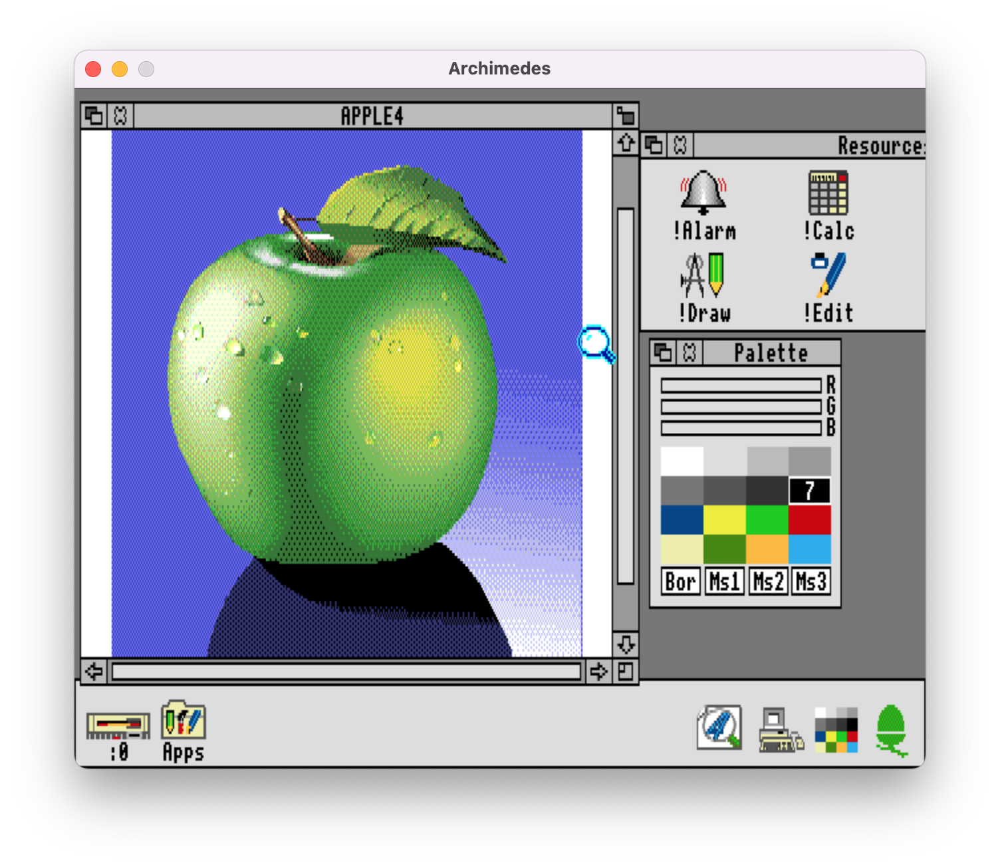
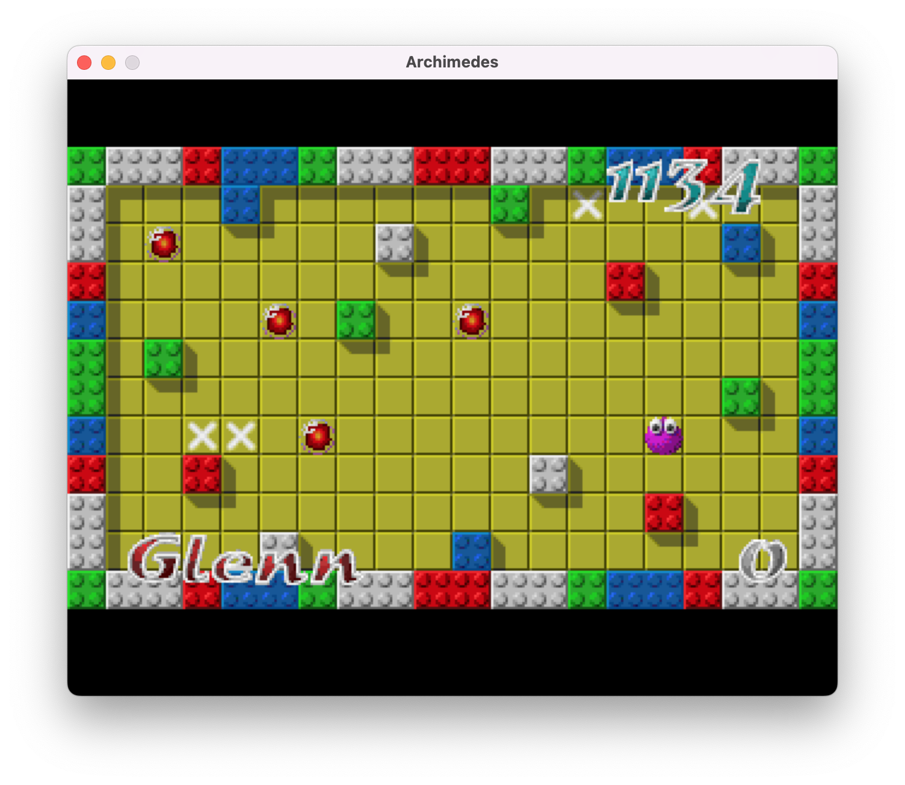
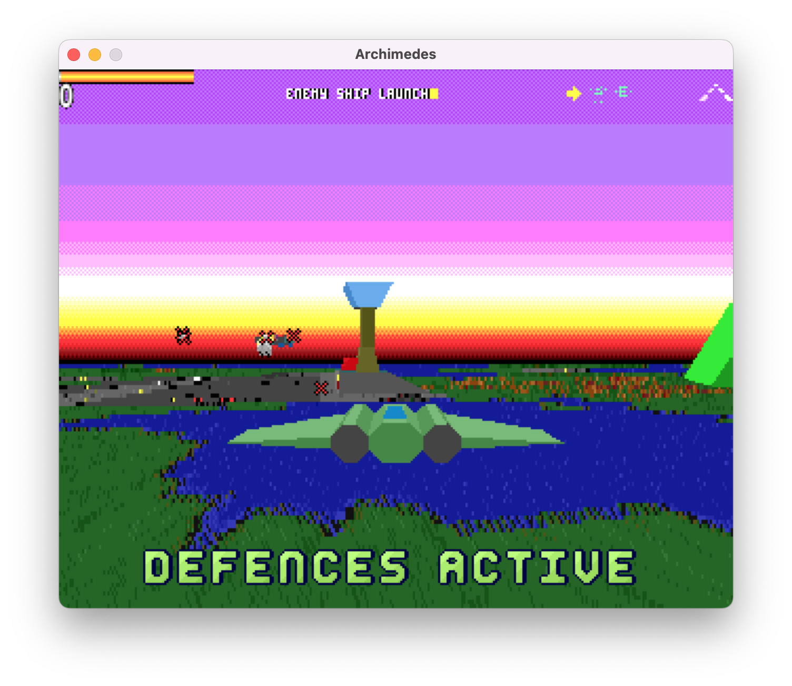

# Eichhörnchen

Eichhörnchen (German for Squirrel) is an Acorn Archimedes A3000 Emulator for running 26-bit versions of RISC OS 
written in C++23 for Windows, Mac and Linux. It's licensed under the terms of the MIT licence.

<p float="left">
  
  
  
</p>

The project goal is to develop an Archimedes emulator with a high degree of test coverage
to deliver a great user experience.

## Building

### Requirements
Eichhörnchen requires C++23 and uses CMake as its build tool (3.31.9 or later).

### Build steps

To perform an out of source build run the following series of commands

```bash
git clone https://github.com/RichardBrown384/Eichhoernchen.git
mkdir build
cd build
cmake -G <preferred generator> ../Eichhoernchen
```

### Running tests

To run the tests run the following command in the build directory
```bash
ctest --verbose -C debug
```

## Running

### Requirements
In order to run the application you're going to require a copy of RISC OS 2.00 (or 3.00 or 3.1x) [ROMS][riscos-com]
(⚠️Certificate not valid⚠️).

You will need to create a Data Directory with the following structure

```text
DataDirectory/
└── os/
    ├── IC24.ROM
    ├── IC25.ROM
    ├── IC26.ROM
    └── IC27.ROM
```

and you need to place your copy of RISC OS in the `os` subdirectory.

If you have multiple versions RISC OS you can create a Data Directory for each version.

### Running
Assuming the application was built in a directory called `build` you can run the application with a disc image
by typing 

```bash
./build/Frontend/frontend archimedes --dataDirectory=<path to data directory> your_disc.adf
```

While starting Eichhörnchen for the first time hold down delete key to force RISC OS to perform a CMOS reset. 
If the reset was successful you will be presented with a desktop replete with Icon Bar. Eichhörnchen will save a copy 
of the CMOS RAM into the Data Directory on shut down.

## Mouse
We currently rely on SDL 3 to manage the relative mouse input required to drive the KART interface. This
has some downsides in that SDL 3 captures the mouse, and that makes things like dragging and resizing the
window cumbersome.

As a workaround, Eichhörnchen no longer starts up with the mouse in relative mode and in order to interact
with the WIMP environment you have to click in the window first. This will engage relative mouse mode and
make the mouse operative. If you switch away from Eichhörnchen the relative mouse mode is disengaged.

## Current limitations

The application should be considered as pre-release material and there are a couple of nice-to-haves that are
currently missing that severely impact the usability.

1. Any changes made to floppy discs aren't saved when the application exits (see [#16][iss16]).
This is currently a safety feature since protecting user data is paramount.

## Planned future work

The focus for now will be on adding tests to those components that got missed during that
difficult stage of development known as staring at a blank screen and examining logfiles to
find out why things weren't working. 

After the tests have been written, the plan is to then implement missing features
such as saving changes to floppies and state before turning our 
attention towards performance.

New capabilities, such a hard disc support, are postponed until the application is 
comparatively bug-free and performant.

## Thanks

Eichhörnchen relies on the following libraries and the authors would like to express their thanks to

1. [Google Test][google-test]
2. [SDL 3][sdl-3]
3. [zlib][zlib]
4. [libzip][libzip]
5. [argparse][argparse]
6. [spdlog][spdlog]
7. [fmtlib][fmtlib]

---
[riscos-com]: https://riscos.com/emulation/index.php
[google-test]: https://github.com/google/googletest.git
[sdl-3]: https://github.com/libsdl-org/SDL.git
[zlib]: https://github.com/madler/zlib.git
[libzip]: https://github.com/madler/zlib.git
[argparse]: https://github.com/p-ranav/argparse
[spdlog]: https://github.com/gabime/spdlog.git
[fmtlib]: https://github.com/fmtlib/fmt.git
[iss2]: https://github.com/RichardBrown384/Eichhoernchen/issues/2
[iss9]: https://github.com/RichardBrown384/Eichhoernchen/issues/9
[iss16]: https://github.com/RichardBrown384/Eichhoernchen/issues/16

